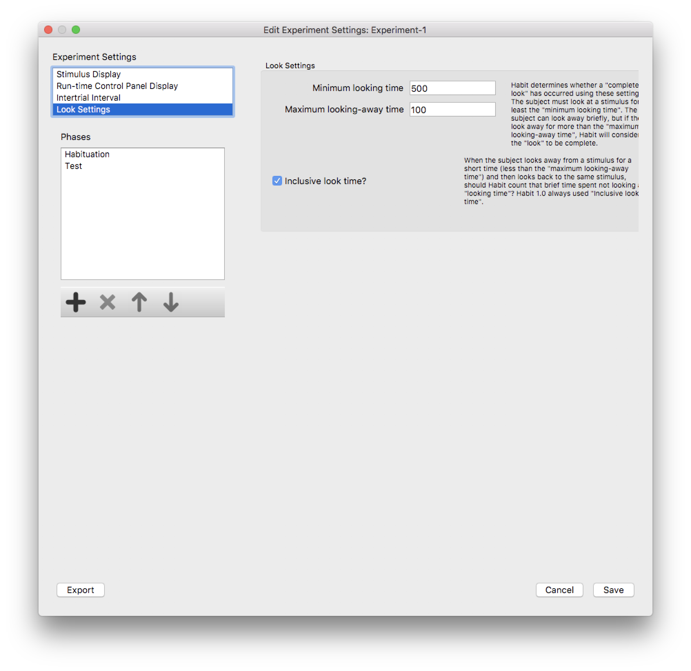
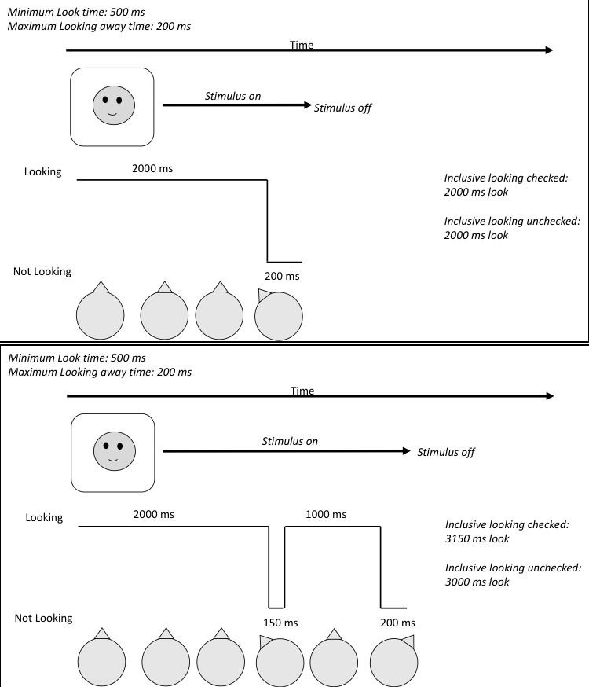

.. _looksettings-label:

Look Settings
=============

During an experiment, the experimenter can use the keyboard to tell Habit that the subject is looking at a stimulus, 
or that they are *not looking* at a stimulus. Habit uses a small set of rules, which are specified on the *Look Settings* page,
to interpret the pattern of looking. 

In some cases, the experimenter may only be interested in the total amount of "looking" - time that the subject spends
looking at a stimulus - and not how multiple periods of looking are combined to for distinct "looks". In those cases, the 
values on the *Look Settings* page should be set to their minimum values (*Minimum looking time* set to 1ms, *Maximum 
looking-away time* set to 0ms). 

In other cases, the experimenter may be interested in identifying specific looking periods that are distinguished by a
period of looking away from the stimulus. These looking periods are referred to as "complete looks", and can be used by Habit
to trigger the end of a trial. 

Habit interprets keypresses on the "4", "5", and "6" keys to indicate looking to the *left*, *center*, and *right*, respectively.
The choice of these keys makes sense when you think of the keys on a keyboard's keypad (if you are working on a laptop, you likely
don't *have* a keypad, but the "4", "5", and "6" keys are still used).

.. note:: If you are running an experiment which displays stimuli on a *single screen*, then you should always use the "5" key to indicate 
   looking at the *center* screen. If you are running an experiment which displays stimuli on *dual screens*, use the "4" ("5") key to 
   indicate looking at the *left* (*right*) screen. 
   
   For dual-screen experiments, this is especially important, as Habit will treat (and report on) looks to the *left* and *right* separately. 

   
   **Figure 1:** The *Look Settings* dialog.

Habit defines a "complete look" at a particular stimulus as a period where the subject looks towards that stimulus for 
*at least* the **mimimum looking time**, *and* the subject looks away from that stimulus for more than the **Maximum looking-away
time**. If the subject looks away from the stimulus for *less than* the **Maximum looking-away time**, and them looks back to the 
stimulus, Habit will combine the subsequent looking time with the previous looking time.

For example, suppose the *minimum looking time* is set to 1000 ms and the *maximum looking-away time* to 1000 ms.
This will mean that Habit2 will only count as a look any keypress that is at least 1000 ms that is followed by a release 
of the key that is at least 1000 ms. Thus, if an observer presses a key for at least 1000 ms, releases the key for 500 ms, 
and then represses the key, Habit2 will not end the look. Instead, the duration of the second keypress will be included 
in the look duration. 

The “look settings” dialog has an “Inclusive look time” option. 
This checkbox allows the user to instruct Habit2 how to treat brief periods of looking 
away that do not meet the looking-away criterion—such as the 500 ms between keypresses indicated in the example just 
described. The question is whether the amount of looking recorded for that trial (or look) should include that 500 ms when 
the observer was not pressing a key. When “Inclusive look time” is checked, Habit2 will calculate look time from the 
start of looking until the criterion for ending a look is met—not including the “maximum looking-away time” which concludes 
the “look,” but including those brief looking away times (this is how the original version of Habit2 calculated looking times). 
When this box is not checked, Habit2 will calculate the looking time only including the periods of time when the key was pressed.

Thus, given the 1000 ms minimum looking time and 1000 maximum looking-away time, if the observer presses a key 
(indicating the infant is looking) for 1500 ms, releases the key for 500 ms (indicating a brief look away), 
and then presses the key for another 2000 ms before releasing it for at least 1000 ms, different total looing 
times will be reported depending on whether or not the “inclusive looking time” box is checed. If it is checked, 
Habit2 will report the total looking time to be 4000 ms (1500 ms of looking + 500 ms looking away + 2000 ms of looking). 
If the box is not checked, Habit2 will report the total looing time to be 3500 ms (1500 ms of looking + 2000 ms of looking).

*Why would one want to use one option over the other?*
In some labs or procedures, the maximum look-away time is set to be fairly short, and it is intended to capture 
moments when the infant only very briefly looks away or when the observer misperceives a shift in looking as the 
initiation of a look away. In these cases, these brief looks away may not actually signal the end of looking, 
and thus the researcher may wish to conservatively include them in the total amount of time looking. 
In other cases, the maximum looking away time may be relatively long because the researcher wishes to ensure 
infants are truly disengaged from the stimulus before ending a look (and perhaps a trial; see xxxxxxxx section). 
In this case, the periods of looking away may be relatively long, and may even last for 1000 or more 
(depending on the settings) and the researcher may be concerned that including these looking away times 
will provide an overestimate of the infants’ looking. Neither option is wrong; the particular settings employed 
reflect the goals and values of the researcher.  Habit2 has been constructed so that it can be flexibly configured to 
instantiate different practices adopted in different lab cultures. Moreover, because the settings may be made available 
in open science repositories, the use of this setting will make it more transparent how different labs define looks 
in their studies.

   
   **Figure 2:** An illustration of how look settings affect the interpretation of a sequence of looking

