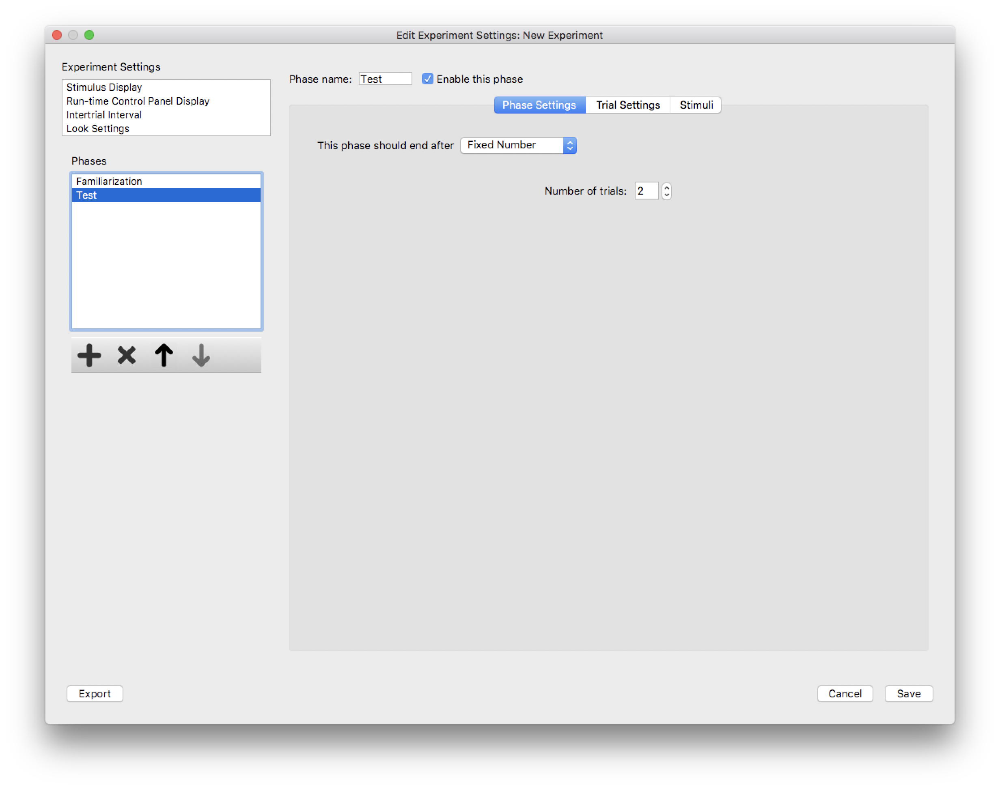

Phase Settings
==============

The phase settings for a new phase are determined when the phase is created. After that, however, the phase settings,
including the *phase type*, may be changed on the Phase Settings tab. First, select the phase from the *phases* list box, 
and click the *Phase Settings* tab. 

   
   **Figure 1:** The phase settings tab for a particular phase in the *Experiment Editor* dialog. 
   This phase is configured to be a *Fixed Number of Trials*, but can be changed here. 
   
The type of phase may be changed here by selecting an option in the combo box labelled 
"This phase should end after...". The options relevant to the phase type chosen, which were
initially configured when the phase was created, may be changed here.
 
