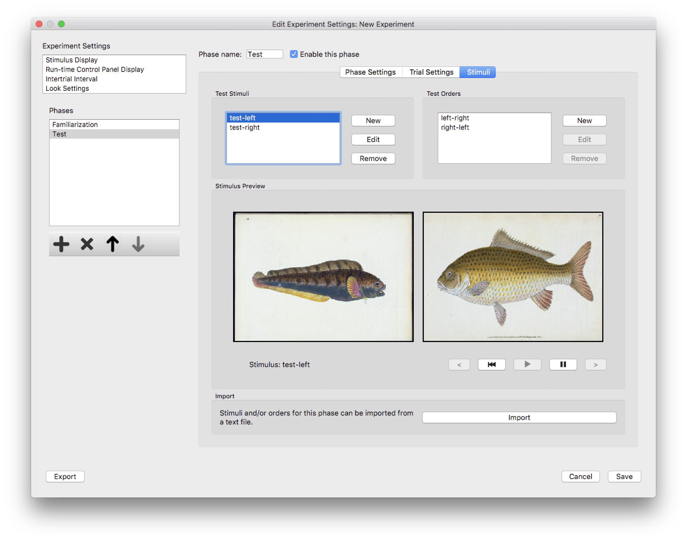
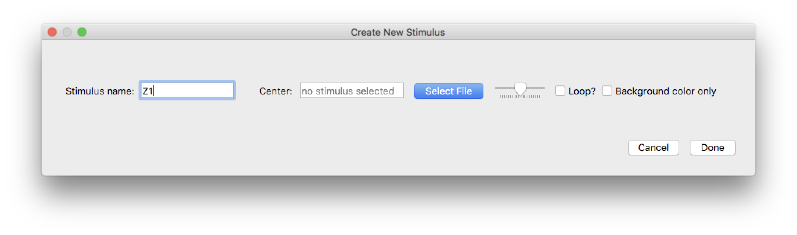
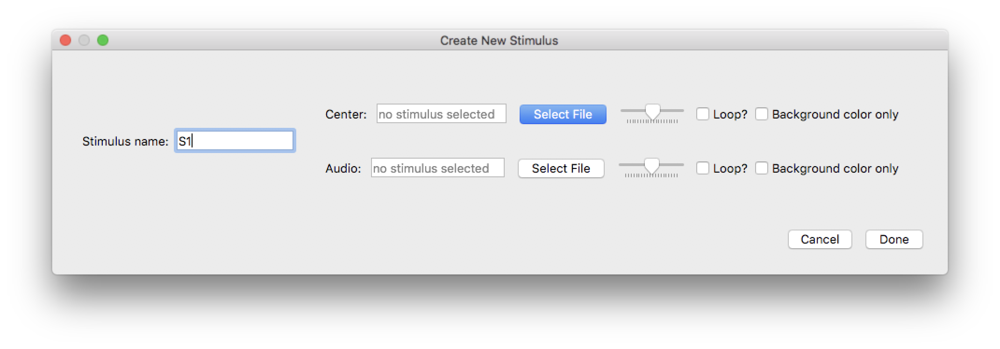
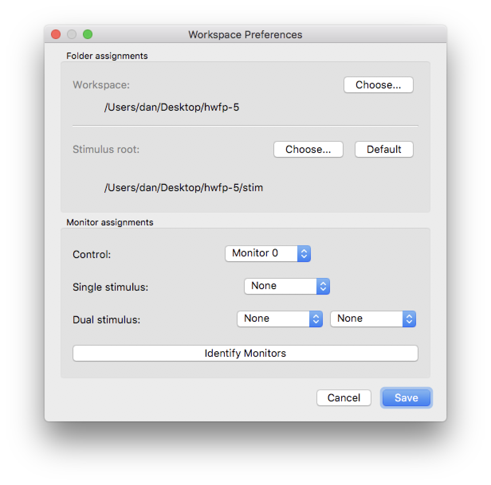
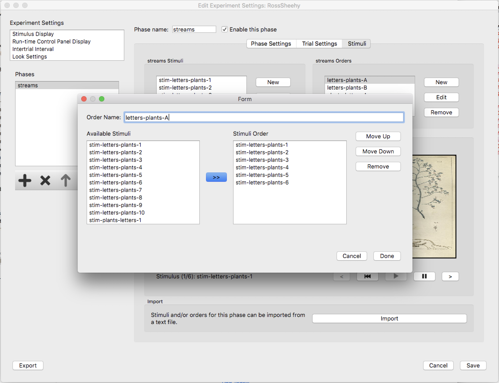

Stimuli
=======

Stimuli for each phase are configured on the *Stimuli* tab:

   
   The *Stimuli* tab for a specific phase in the *Experiment Editor* dialog. 
   
This tab displays a list of configured *stimuli* and a list of configured *orders*. In this context, 
we use the term *stimulus* to refer to the combination of video (either still images or movies) and
and audio (either standalone audio files, or the audio track taken from a movie file). An *order* is a 
specific ordering of the configured stimuli that can be used when the experiment is run. You must configure
at least one stimulus for a phase, but it is not necessary to configure any orders. 

A display widget (or two, if your experiment is configured for dual stimuli) shows the selected stimulus. 

An option exists to import stimuli for a phase. The format of the import file is described below. 

Configuring Stimuli
-------------------

Stimuli for a phase are configured by clicking the "New" button next to the stimuli list for the phase. 
An existing stimulus can be modified by selecting the stimulus in the list and clicking "Edit", and a
stimulus may be removed from the list by selecting the stimulus and clicking "Remove". 

When creating a stimulus, or editing an existing stimulus, the dialog contents will depend on whether the 
experiment is configured to use one or two screens, and whether or not independent sound stimuli are to be
used. 

   
   Dialog for experiments configured for a single stimulus and no independent sound stimuli. 
   

   
   Dialog for experiments configured for a dual stimuli and no independent sound stimuli. 
   

   
   Dialog for experiments configured for a single stimulus and independent sound stimuli. 

Each stimulus type has a button to browse and select a file from the local filesystem (or a network drive
accessible from the local machine). A volume slider allows you to set the volume to be used for the stimulus
(if the stimulus does not have sound this is ignored). 

If the "Loop" checkbox is checked, then the stimulus will play to the end and repeat until the trial ends. This
checkbox has no effect for still images. A movie file will play to the end and freeze on its last frame if the 
"Loop" checkbox is checked and the trial runs for longer than the play time of the video. 

An option also exists to display only the configured background color, with no stimulus image, if the "Background
only" checkbox is checked. 

The Stimulus Root Directory
~~~~~~~~~~~~~~~~~~~~~~~~~~~

The Habit preferences dialog has a setting for the folder to be used as the *Stimulus Root*. 
This setting can be useful when sharing or moving 
Habit experiments (or entire workspaces) between different computers. 

.. note:: If you are *creating* and *configuring* experiments on the same computer that you will use to 
   *run* the experiments, then the value of the *Stimulus Root* doesn't matter. Your stimulus files will
   always be found (as long as the files themselves remain in the same location), and you don't need to
   change the *Stimulus Root*. 
   
When you select a stimulus file as described above, Habit compares the file path to the current value of the 
*Stimulus Root*. If the file path is within the folder (or in a subfolder in the hierarchy *beneath* the root
folder), then Habit stores only the portion of the file path *after, or below, the root folder itself*. In all 
other cases, Habit stores the full path to the stimulus file.

   
   The *Preferences* dialog can be used to configure the *Stimulus Root Dir*. 

Once a stimulus file is saved using a path relative to the *Stimulus Root*, Habit will always look for the file
using the currently configured root dir. There are two important things to remember about the *Stimulus Root* 
folder 

* the value you specify in the *Preferences* dialog is saved on the computer where Habit is running
* the value is unique to the *Workspace* that you are working in. Different workspaces on the same computer
  can have different values for the *Stimulus Root*. 

If you move an experiment from one computer (or workspace) to another, or if you 
modify the *Stimulus Root Dir* for the workspace where the experiment resides, then Habit may not be able to 
find the stimulus file at the location that was saved for it. 

.. note:: Habit will display stimuli names with a yellow background if any of the configured files cannot be found
   on the local filesystem. This can happen if the experiment configuration was moved from one machine to another (either
   by moving the entire workspace, or by exporting the configuration and importing the experiment on another machine), 
   and the stimuli files are not found at the stored file paths. 

Using the Default Stim Root
~~~~~~~~~~~~~~~~~~~~~~~~~~~

Each time Habit creates a new workspace, it creates a folder called *stim* inside that workspace. When you select the 
*Default Stimulus Root*, Habit uses this *stim* folder within the workspace as its stimulus root. When you use this root, 
you can put all your stimuli into the *stim* folder in your workspace (or into a folder hierarchy below that folder), and
the locations of all stimuli will be saved as locations relative to that root folder. 

Setting up your Habit workspace like this - using the *Default Stimulus Root* - means that you can treat your Habit workspace
folder as a self-contained entity. Moving the entire workspace to another location (either on the same computer, or on another
computer), means that all you need to do on the target computer is to ensure that the *Stimulus Root* is set to the default for 
that workspace.  

Using a shared network folder as the *Stimulus Root*
~~~~~~~~~~~~~~~~~~~~~~~~~~~~~~~~~~~~~~~~~~~~~~~~~~~~

In a lab where a user may develop an experiment while working on one computer (their own laptop, for example), but will later *run* the 
experiments on a *different* computer, the configuration of the workspace and the *Stimulus Root* (and, consequently, 
the paths stored for the various stimulus files) is important. 

There are several ways to ensure that the stimulus files are found when running Habit on either computer in this scenario. Here are two 
such methods:

1. Create the workspace in a shared network location, and use the *Default Stimulus Root*. In this case, Habit will store
   relative locations for the stimuli files *within the default stim folder*. On each computer that accesses this shared 
   workspace location, the *Default* stimulus root should be chosen in the *Preferences* for that workspace. Remember, the 
   settings in the *Preferences* dialog are saved on a per-computer, per-workspace basis. Since the file path to the workspace
   itself will vary from computer to computer (because it is in a network path, the actual path from various computers can be 
   different). 
2. Create the workspace on the local computer, but set up a shared network location as the *Default Stimulus Root*. This may be
   a convenience for a lab that has a large collection of stimulus files that are shared across multiple experiments, or 
   chooses to consolidate their stimulus files in a central location for some other reason. Under this scenario, an experiment
   configured using the shared network location as its *Stimulus Root* can be exported and moved to another computer. On the 
   target computer, import the experiment into a workspace and set the *Stimulus Root* to the same network location. Similarly, 
   the entire workspace may be moved to another computer, and the *Stimulus Root* should be set on the target computer after
   opening the workspace. 

Configuring Stimuli Orders
--------------------------

Stimuli orders may be configured for a phase once you have some stimuli configured (see above). To create a new order, click
"New" button next to the stimuli order list for the phase. 
An existing stimulus order can be modified by selecting the stimulus in the list and clicking "Edit", and a
stimulus order may be removed from the list by selecting the order's name and clicking "Remove". 

   
   Stimulus orders are created and modified using this dialog. Individual stimuli are added to the order by selecting them and
   clicking the ">>" button (similarly, they are removed from an order by clicking the "<<" button), or by double-clicking 
   the stimulus name in the "Available Stimuli" list. Stimuli may be moved up or down in the order by selecting the stimulus name
   in the "Stimulus Order" list and clicking either "Move Up" or "Move Down".
   
 
