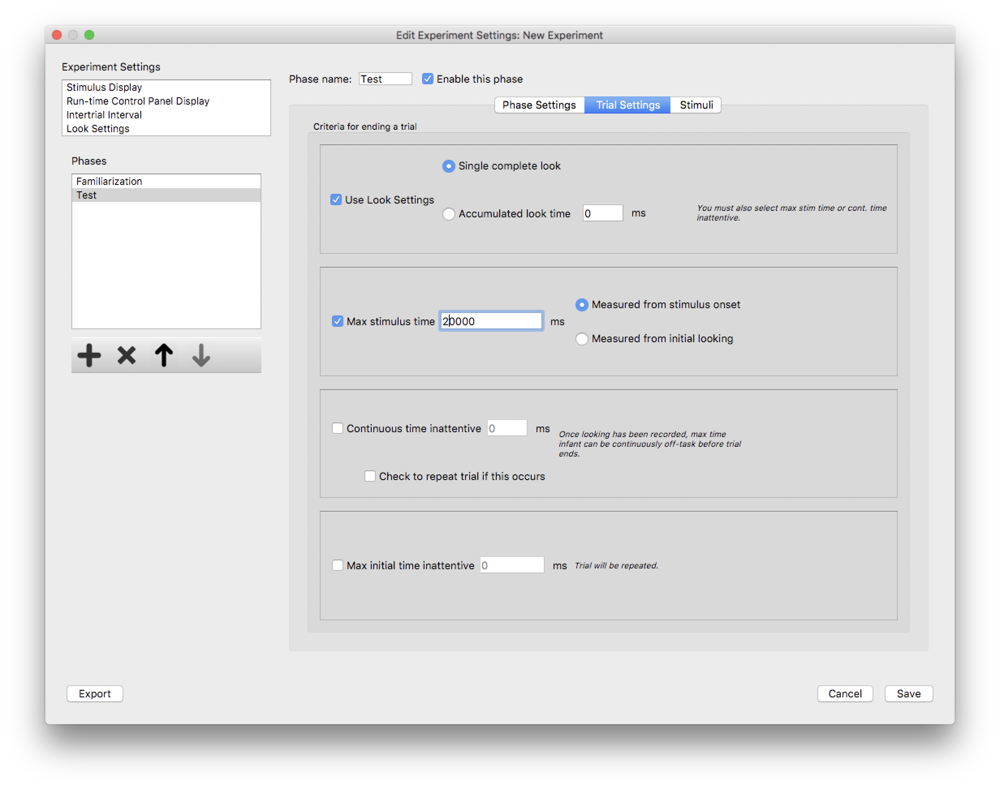

Trial Settings
==============

The basic settings for individual trials in a phase are configured when the phase is created. By selecting
the newly-created phase in the *Phases* list box, and clicking the *Trial Settings* tab, the detailed settings
for individual trials in the phase may be configured. 

   
   The *Trial Settings* tab for a specific phase in the *Experiment Editor* dialog. 

On this tab you may change the name of the phase, or you may enable/disable the phase with a checkbox. A disabled
phase is excluded from the experiment when it is run, but its settings and stimuli are retained. 

The *Trial Settings* specify the conditions under which a trial will *end*. One or more of these settings may be 
used. Each of these conditions are explained in detail below:

* `Using Look Settings to end a trial`_ 
* `Using maximum stimulus time to end a trial`_
* `Ending a trial due to inattention`_
* `Ending a trial due to inattention at the start of the trial`_

Using Look Settings to end a trial
----------------------------------

By checking the *Use Look Settings* box, you can use one of two options to end a trial based on the subject's looking
behavior. 

If you select the "Single complete look" option, then Habit will monitor the experimenter's keystrokes during stimulus
presentation and use the *`Look Settings`_* to wait for a complete look. Note that a look is not *complete* until 
the *minimum looking time* and the *maximum looking-away time* criteria of the *Look Settings* are satisfied. 

If you select the "Accumulated look time" option, then Habit will monitor the experimenter's keystrokes during stimulus
presentation and add up *all looking* (even looking that does not satisfy the definition of a "complete look"). When the 
sum of all looking adds up to the accumulated look time specified here the trial is ended. 

Using maximum stimulus time to end a trial
------------------------------------------

Trials may be ended after a fixed time. The fixed time may be measured in one of two ways: relative to the *onset of the 
stimulus* (i.e. when it first appears on screen), or relative to when the subject *first looks at the stimulus* (as determined
by an experimenter keystroke).

The first of these options, where the maximum stimulus time is measured relative to stimulus onset, can be used to provide
a certain ending to trials where the subject may be inattentive or distracted. 

The second of these options, where the maximum stimulus time is measured relative to the initiation of looking, will not
apply to trials where the subject *never looks* at the stimulus. If using this option, be sure to use another option, such
as one of the inattention options below, to ensure that a trial *will* end. 

Ending a trial due to inattention
---------------------------------

When this option is used, a trial will end after a specified period of inattention (determined by the absence of experimenter
keystrokes). By default, the trial is *not repeated*, but there is an option to repeat the trial if this occurs. 

Note that the period of inattention is only measured after an initial period of looking. A *complete look* is NOT required; 
Habit only looks for a single keystroke during stimulus presentation. Once that occurs, Habit will measure periods of inattention
(when the experimenter is not holding down any keys) until this condition is satisfied. 

This option is similar to, but not the same as, the option below, where a trial is ended due to inattention at the 
start of a trial.

Ending a trial due to inattention at the start of the trial
-----------------------------------------------------------

This option is similar to *Ending a trial due to inattention* above, except that the period of inattention is measured from the 
start of the trial (after the initial onset of the stimulus). In this case, no initial looking is required. 
The trial is always repeated when this occurs. 

This option may be useful when your experiment uses an attention getter, but the experimenter inadvertently starts the trial
when the subject is not ready.

Once any looking is recorded, this option for ending the trial no longer applies. The *Ending a trial due to inattention* option 
above, if configured for the phase, would be applied once *some* looking has occurred. 

