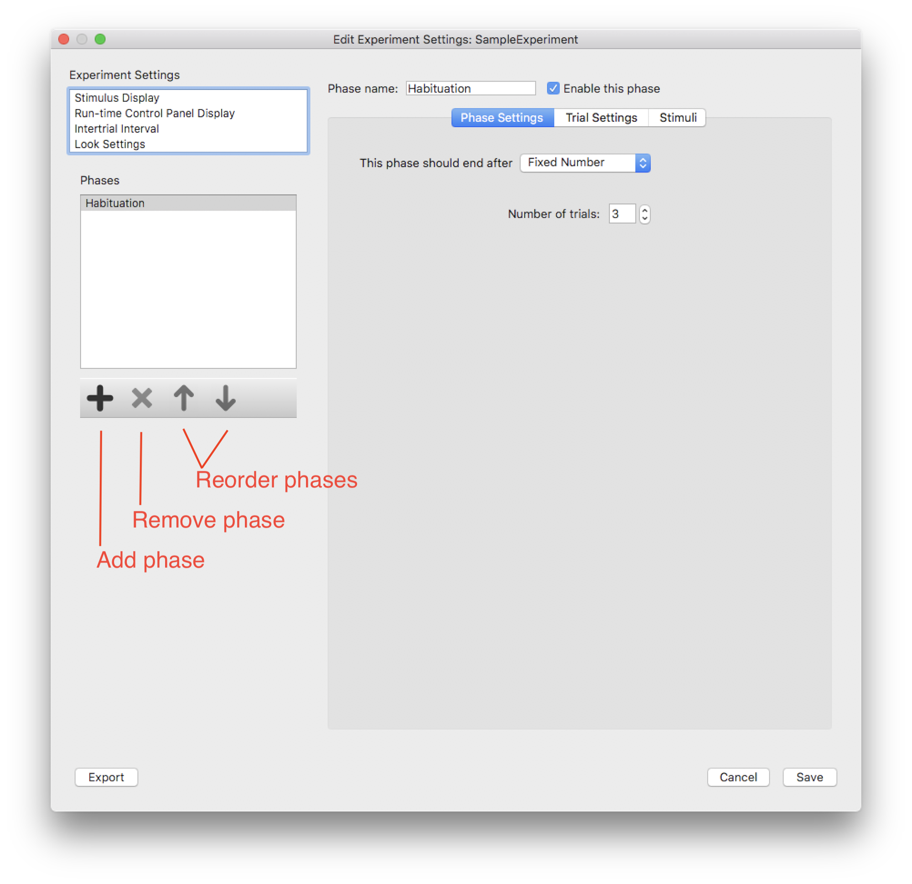
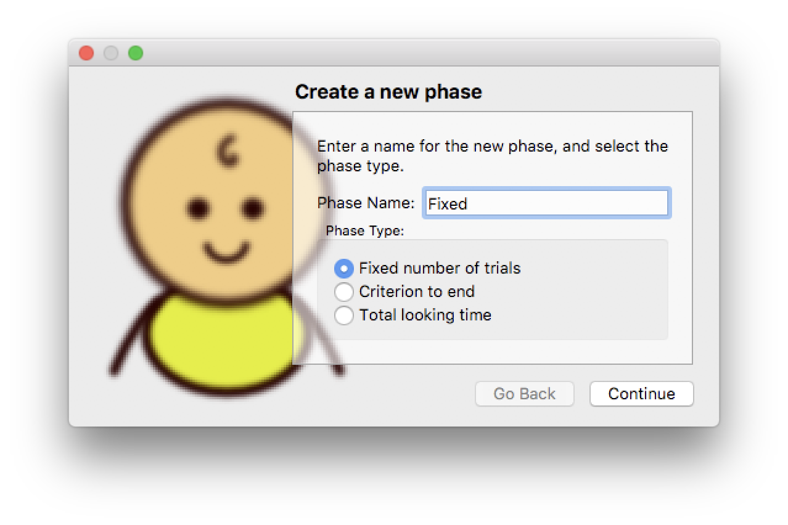
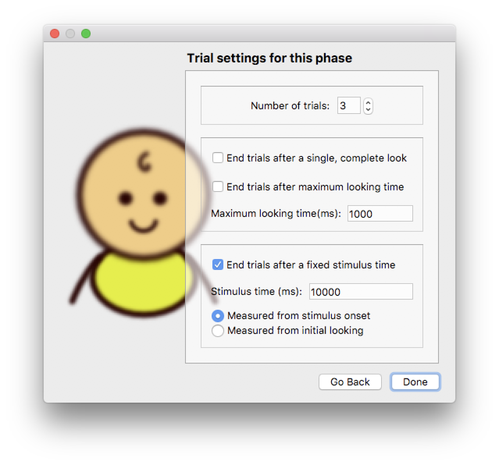
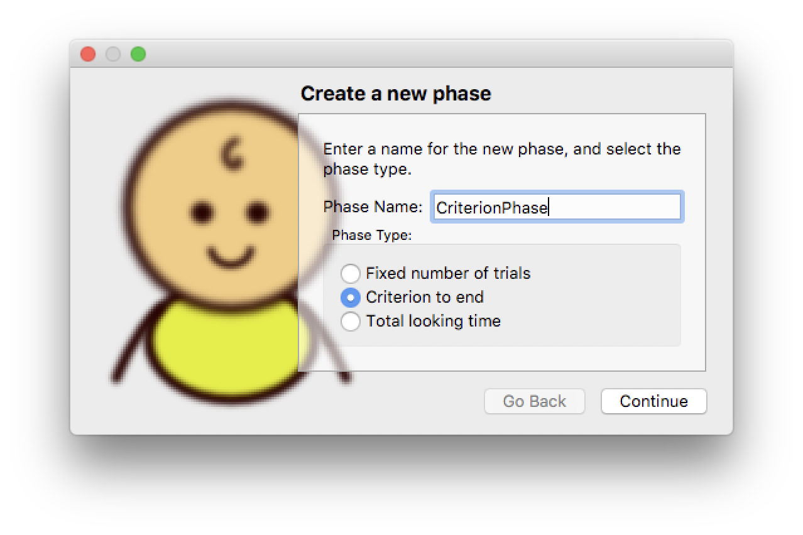
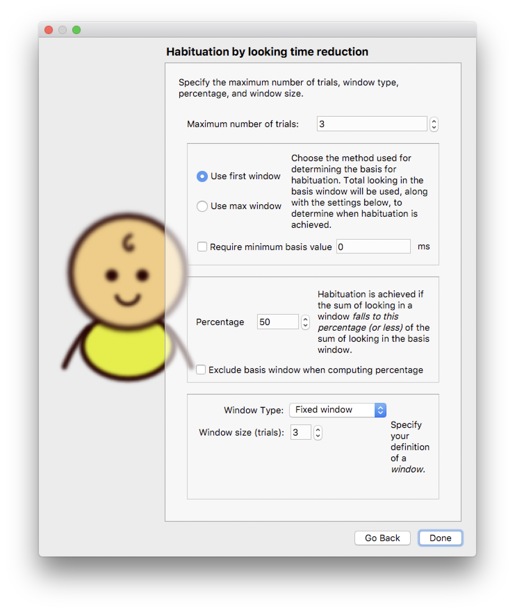
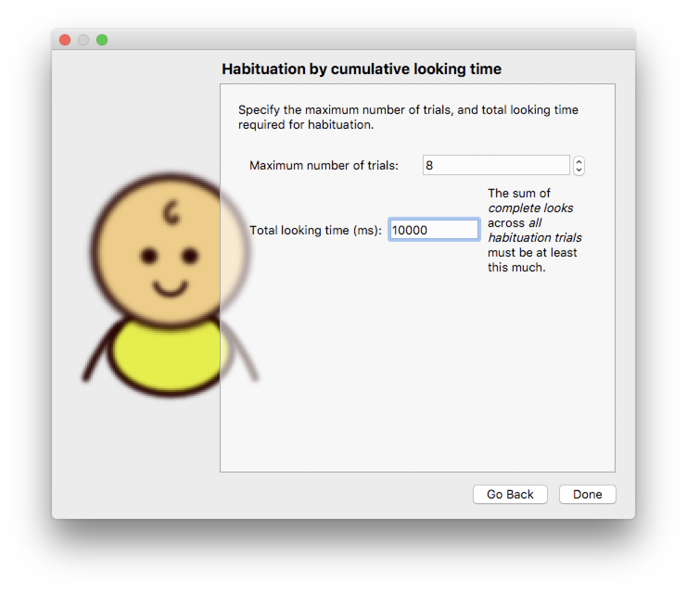

Phases
======
.. toctree::
   :maxdepth: 3
   :hidden:
   
   _phase_phasesettings
   _phase_trialsettings
   _phase_stimuli

Each experiment is made up of one or more *Phases* — the number of phases is unlimited. 
For example, in a standard paired preference experiment, there may be a single phase during which a 
series of trials is presented. A violation of expectation paradigm may use two phases—a pretest and a 
violation of expectation trials. A habituation experiment may have a pretest phase, a habituation phase, 
and a test phase. However, there are no constraints on the number or type of trials, thus users can combine 
different types of phases in any way that they wish. 

Each phase consists of a series of trials. There are three aspects of each phase that must be specified: 
the phase type, the trial settings, and the stimuli. These settings can vary across phases, but all phases are 
constrained by the number of stimulus display, real-time control, intertrial interval, and look settings specified 
for the experiment as a whole.

To add a phase to an experiment, click the *Add Phase* tool button at the bottom of the “phases” box.  
You will be asked to give a name for the phase, and to specify its basic settings. 
These initial settings can be modified and refined once the phase has been created. Phases can be 
moved and re-ordered using the other tool buttons (see figure 1).

   
   **Figure 1:** The phase manipulation tools in the *Experiment Editor* dialog. 
   The *Remove*, *Move Up*, and *Move Down* tool buttons operate on the currently selected phase.

Once a phase has been created, it is listed in the **Phases** list box. When a phase in the **Phases**
list box is selected, its detailed settings can be modified using the three tabs, labelled *Phase Settings*, 
*Trial Settings*, and *Stimuli*, shown in the right-hand pane of the *Experiment Editor* window. 

Phase Types
-----------

When creating a new phase, you must specify what *type* of phase you want (the phase type can be changed
after the phase is created). There are three phase types in Habit:

* `Fixed Number of Trials`_
* `Criterion to End`_ (Reduction of looking time)
* `Total Looking Time`_

Fixed Number of Trials
~~~~~~~~~~~~~~~~~~~~~~

A **fixed number of trials** phase consists of a specified number of *successful* trials. When a trial is 
*repeated*, the repeats are not counted towards the total trial number.  
These phases are not complete until all of the trials have been presented and completed successfully.
The settings for trials in the phase are used to determine what constitutes a "successful" trial. 

When creating a phase with a **fixed number of trials**, you must first give the phase a name. 

   
   **Figure 2:** Creating a new phase with a **fixed number of trials**.  

Next, you must specify basic trial settings for the phase. 

   
   **Figure 3:** Creating a new phase with a **fixed number of trials**. Specify the number of trials and 
   basic trial settings (which tell Habit how the trials will end). 

Trials can be controlled by subject looking behavior. You may specify that trials end on a single, complete look, 
or after an accumulated amount of looking. 

Trials can also run for a specific time. The time may be measured relative to the onset of the stimulus, or 
relative to the onset of looking by the subject. 

.. note:: If trial settings use looking behavior to end individual trials, you should also specify *another setting*
   that will end trials if the subject *is inattentive and does not look at all*. The **fixed stimulus time** 
   settings serve this purpose - they limit trials to a maximum time. 
   
   When trials end due to the maximum stimulus time, they are considered "successful" trials and are not repeated. 
   
Criterion to End
~~~~~~~~~~~~~~~~

Criterion phases continue until infants’ looking decreases by a specific percentage from a baseline level. When 
configuring a phase of this type, you must give the phase a name and specify the basic trial settings as for the 
**fixed number of trials** type above (see figure 2 above).

   
   **Figure 4:** Creating a new phase with a **Criterion to End** type.  
   
In addition, you must specify the parameters to be used for the criterion. 

   
   **Figure 5:** Specifying the phase-ending criterion. 
   
First, you must specify the *maximum number of trials*. If the subject is not habituated (according to the settings
you specify) after this many trials, the phase will end. 

The *reduction of looking time* criterion uses the sum of all looking during a series of trials, or *window*. The size
of the window is the number of consecutive trials that are included in the sum. The type of the window can be *fixed* or 
*sliding*. A *fixed window* type uses non-overlapping sequences of trials. For example, a fixed window or size 3 means that
Habit will sum looking in trials 1-3, 4-6, ... and test the criterion to determine if the phase should end. A *sliding window*
uses overlapping sequences of trials. For example, a sliding window of size 3 means that Habit will sum looking in trials 
1-3, 2-4, 3-5, ... and test the criterion to determine if the phase should end. 

Fixed windows are often used when researchers want to ensure that infants see each stimulus the same number of times across 
habituation. For example, if habituation involved 4 different stimuli, the researcher may used an fixed window of 4 items, 
and present each stimulus once in each window or block of trials. If infants habituated in 8 trials, they would see each 
stimulus twice; if they habituated in 12 trials they would see each stimulus 3 times. Thus, fixed windows are useful for 
ensuring equal exposure to a number of individual stimuli across habituation.

However, it is difficult to reach the habituation criterion with fixed windows because habituation is evaluated only on 
every 4th trial. Therefore, often researchers use a sliding or overlapping window. In this case, infants can habituate on 
any trial.  If looking on trial 1 was very long, infants’ looking on trials 2, 3, and 4 might be 50% of their looking on 
trials 1,2, and 3. Thus, although this procedure allows more flexibility for when infants can habituate—and increases the 
number of infants who habituate overall—it may also increase the rate of false habituation as it takes advantage of random 
variation in looking. The point is that Habi2 can be configured with either type of window, allowing researchers to decide 
whether their research question and experimental design is best served by a fixed or sliding window.

When performing the criterion test, Habit must choose the window that will serve as the *basis* for the criterion. Once that 
window is chosen, Habit tests subsequent windows of trials. These tests are performed at the end of each trial until the subject
is habituated (i.e. the criterion is satisfied), or until the maximum number of trials is reached. 

The basis window can be chosen in one of two ways. The *first* window can be used, or the *maximum* window (i.e. the window with the 
most looking) can be used. Some users may wish to use the maximum window if in their experience infants’ looking increases over the 
first few trials, and the maximum looking is not typically observed on the first set of trials. 
Although the maximum window has been used in some studies, the vast majority of researchers use the first window. 
As a compromise, the user may require a minimum amount of looking to be recorded in the basis window. 
In this case, the basis would be the first window as long as it met the minimum looking requirement. 
If infants’ looking on the first trial or trials was relatively short, the first window of consecutive trials that met the minimum 
looking duration would be used as the basis for evaluating habituation.

Next, the user must specify the percentage decrease required to end the phase. Typically, this will be 50%, as the vast majority of 
studies using habituation require a 50% decrease in looking as a criterion of habituation. However, habit2 does not require that users 
adopt this criterion, and they may adopt a more conservative criterion or less conservative criterion if their research question 
justifies it. There is also a checkbox to tell Habit to exclude the basis window when computing percentages. When *fixed windows* are 
used, this checkbox has no effect because the windows never overlap. When *sliding windows* are used, this checkbox will mean that 
the windows containing the trials in the basis window are ignored when computing the sum of looking. For example, if one has a
trial with sliding windows of size 3, and if the window consisting of trials 2-4 is chosen as the basis, then Habit will ignore the 
windows consisting of trials 3-5 and 4-6. The windows consisting of trials 5-7, 6-8, ... are used for computing the percentage of 
reduction of looking time, and hence for determining if the subject is habituated. 

Total Looking Time
~~~~~~~~~~~~~~~~~~

*Total looking time* phases continue until the infant accumulates a specific amount of looking time. When configuring a phase
of this type, you must give the phase a name and specify the basic trial settings as for the other phase types (see figure 2 above).

   
   **Figure 6:** Creating a new phase with a **Total Looking Time** type.  
 
When creating first the user must specify basic settings for individual trials in this phase will end after a maximum 
amount of looking time, or whether the trials should end after the stimulus has been presented for a fixed amount of time, 
measured either from when stimulus onset or from initial looking.
 
Finally, you must specify the accumulated looking time required to end the phase, and the maximum number of trials for the
phase. The phase will end after the maximum number of trials if the subject has not accumulated the required amount of looking. 

   
   **Figure 7:** Specifying the maximum number of trials and accumulated looking time required to end the phase. 

