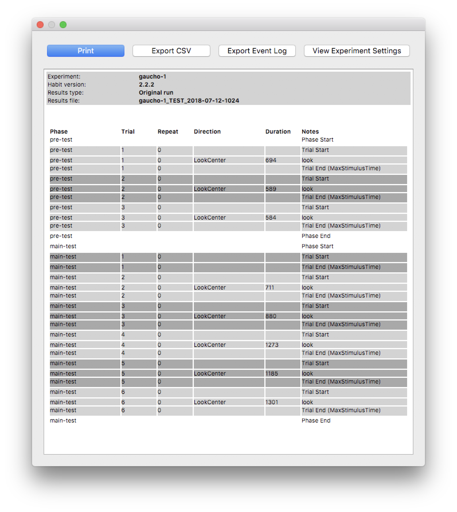

Results
=======

Habit saves detailed information each time an experiment is run. The experimental results may be accessed through the Habit
interface by selecting the experiment name, then clicking the Habit Results Explorer tool from the main Habit dialog.

   
   To view experiment results, select the experiment name and click the *Results Explorer* tool button.
   
Once opened, the *Results Explorer* shows a list of available results files. For each experimental run there are two files:

1. A complete results file, with extension *.hab*
2. A summary results file, in csv format (can be viewed with Excel or Numbers)

   
   The *Results Explorer* dialog allows you to view results file(s) for completed experiments.

.. note:: Results files are named using the experiment name, subject ID (if any), and the date/time when the experimnent was 
   started
   
   For example, an experiment named "MyExperiment", run in test mode, and started on May 25, 2018, at 9:15am, would have 
   a results file named *MyExperiment_TEST_2018-05-25-0915.hab*
   
To view the results for a particular experiment, select the results file (\*.hab) and click the *Open* button (or just double-click
the results filename). 

   
   The results summary displayed at the end of an experimental run. This summary is re-generated and displayed when viewing
   the results of an experiment using the *Results Explorer* dialog. 
   
CSV Results File
----------------

Habit also exports a detailed results file in CSV format. This file can be viewed in a spreadsheet program (Microsoft *Excel*, 
or *Numbers* on the Mac).
