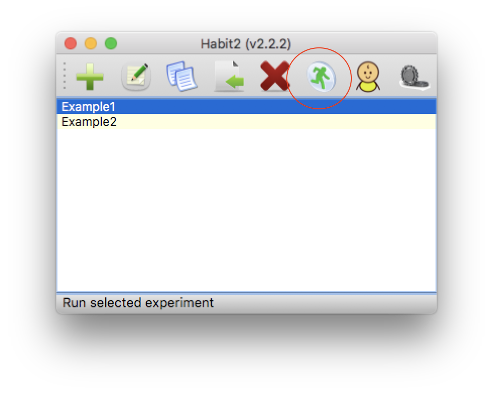
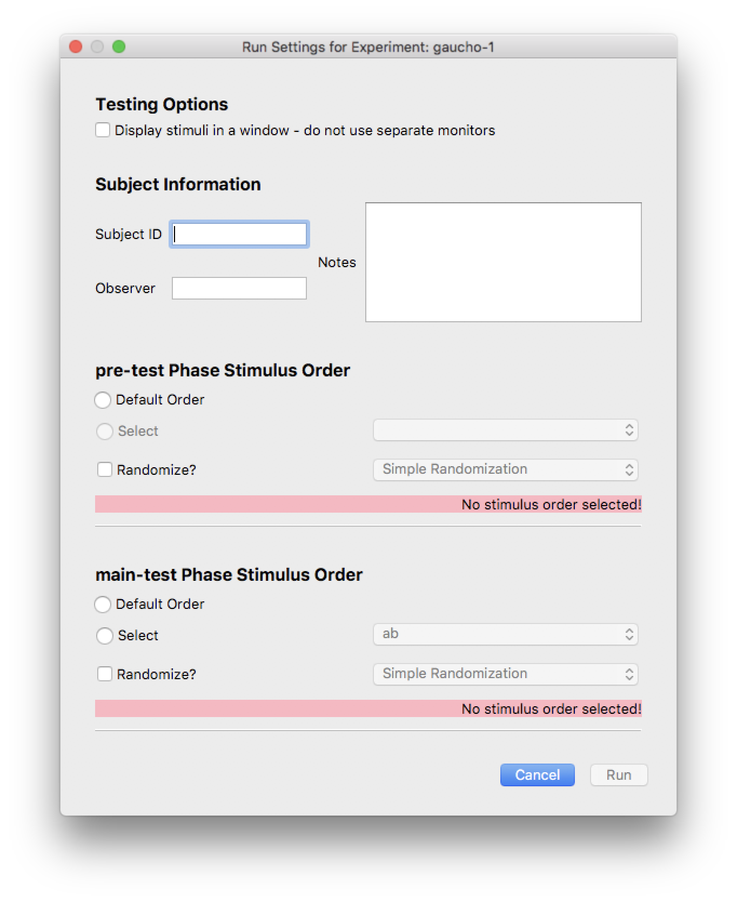
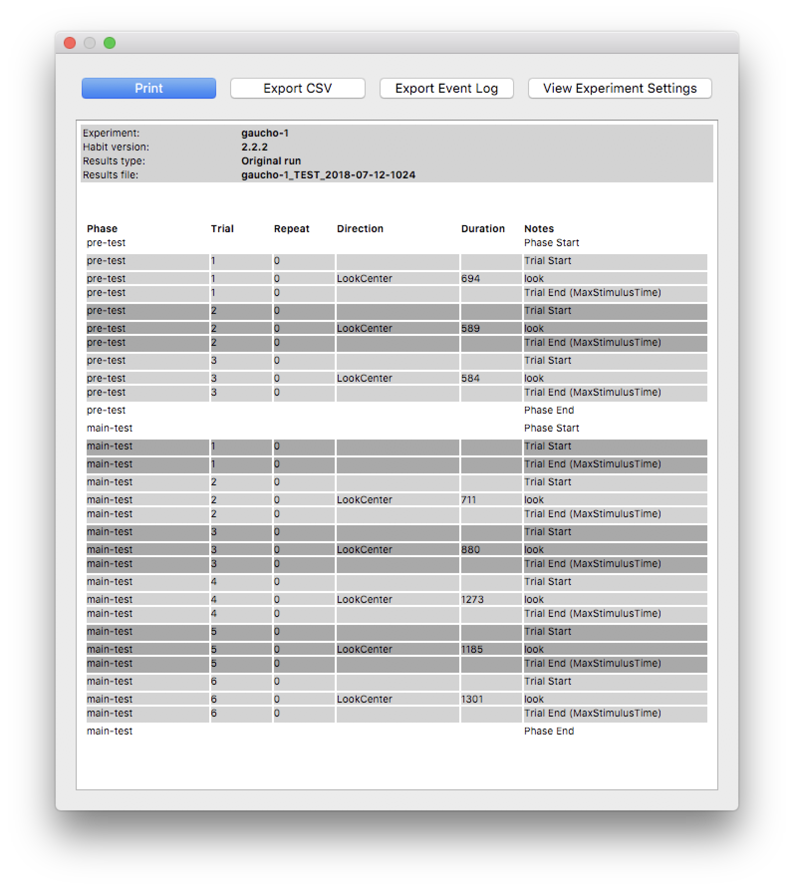

Running Experiments
===================

Once an experiment as been configured in Habit, you may run the experiment. You can run the experiment in a testing mode,
where stimuli are displayed on your local screen. This can be much more useful than testing in a lab situation, where the 
screen(s) which display stimuli to the subject may not be directly visible. 

When an experiment is run, Habit will save a record of the stimuli presented, keystrokes entered by the experimenter, and
actions taken by Habit based on experiment settings. Results are saved in the workspace and can be retrieved and viewed at 
a later time. 

To run an experiment, select the experiment in Habit's main dialog and click the *Run Experiment* tool.

   
   To run an experiment, select the experiment name and click the *Run Experiment* tool button.
   
Habit will perform some cursory checks on the experiment settings to verify that the experiment *can be run*. (An experiment
cannot be run if, for example, any of the stimuli files cannot be found. Habit will display a warning and a list of 
problems that must be corrected in order for the experiment to be run.) 

If the experimental configuration passes these checks, the *Run Settings* dialog is displayed. 

   
   The *Run Settings* dialog for an experiment with two phases. 

Testing Options
---------------

There is one option useful in testing an experimental configuration, labelled "Display stimuli in a window - do not use
separate monitors". If you check this box, Habit will run the experiment as you have it configured, except that the 
stimuli will be displayed in a dialog on your local screen. Without this option selected, Habit will display the stimuli 
on the screen(s) you identified in the *Global Preferences* dialog. Note that there are separate monitor assignments there 
for single-stimulus and dual-stimulus experiments. 

Subject Information
-------------------

The subject information is optional and can be left blank. Note that each experimental run is assigned a unique label
that can be used to retrieve the results. 

Stimulus orders
---------------

Each time an experiment is run, the experimenter must specify the *order* in which stimuli are to be presented in 
*each phase* of the experiment. First, a group of stimuli to present must be selected. There are two ways to do this:

* **Default order** - present the stimuli in the same order that they were configured. This is the order in which they 
  appear on the *Stimuli* tab for the phase. 
* Select an order previously configured on the *Stimuli* tab. 

One of these two radio buttons must be selected. In addition, an option exists to randomize the stimuli ordering selected. 
Randomization may be *simple randomization*, where any of the stimuli selected (either with the default option or via a 
pre-configured order) is chosen at random. The random choice occurs independently for each trial, and as a consequence, some 
stimuli may be repeated and/or omitted entirely. Alternatively, randomization may be *by blocks*. *Block randomization* means 
that the stimuli selected (either using the *default* ordering or a pre-configured order) are presented in a random order, but
in such a way that each stimulus will be presented once before any stimulus is presented a second time.

.. note:: The number of stimuli configured for a phase (or the number of stimuli in a configured *order*) does not have to 
   be the same as the number of trials for the phase. If the number of stimuli configured for a phase is *less than* the 
   number of trials in the phase, then the stimuli ordering chosen will be repeated as needed to complete all the trials.
   If the number of stimuli configured for a phase is *greater than* the number of trials in the phase, then some of the 
   stimuli will not be presented. 
   
In all cases, the Habit event log and results files will always contain the actual stimulus file(s) used and the order 
in which they were presented. 

After experiment is completed...
--------------------------------

On completion of all phases in the experiment, Habit displays a summary of the experiment, how each trial ended, whether the 
subject was habituated (if there were habituation trials), and any looks that were recorded. This summary can be re-generated 
using the results viewer. 

   
   The results summary dialog. The summary page can be re-generated using the results viewer. Additional actions are possible
   using the buttons at the top of the summary. 
   

